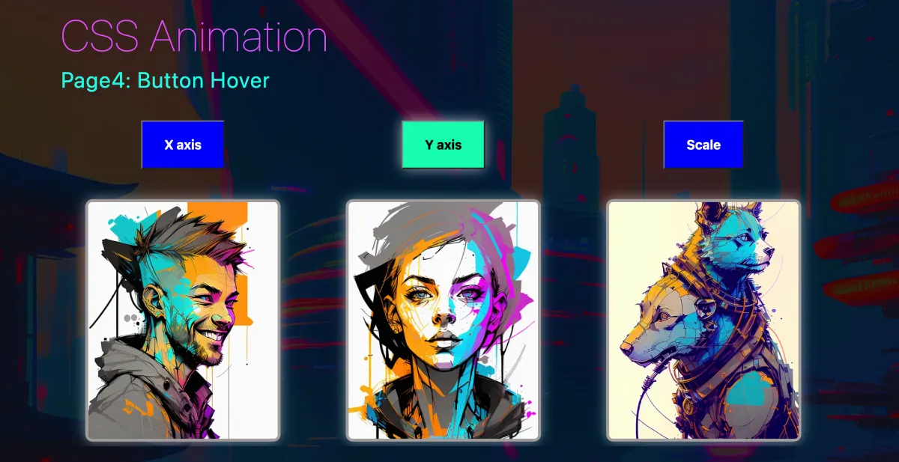

# CSS Animation

The investigation of a range of CSS animation techniques, including transform and keyframes, combined with the utilization of generative AI to create retro-futuristic themed images.

 

## Site
* 👉 [jsohndata.github.io/css-animation](https://jsohndata.github.io/css-animation)